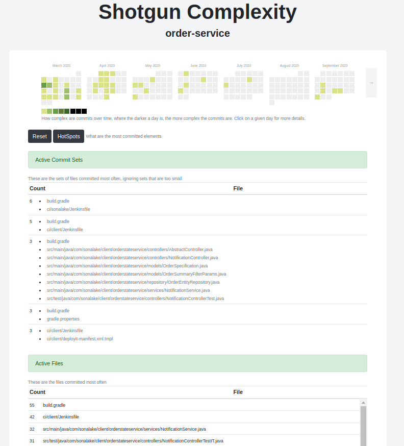
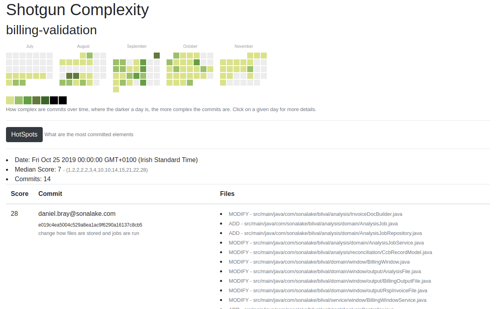

# Shotgun
_(shoot 'em 'fore they run now)_

**NOTE:** this is still being put together; if we think it's a good idea I 
can add a CLI for this, and then a gradle plugin an, who knows, a sonar plugin.

At the moment the project and parameters are hard-coded in 
[com.sonalake.shotgun.App](src/main/java/com/sonalake/shotgun/App.java)

## What does this do?

Performs an analysis of the git history to determine the _"shotgun"_ complexity 
of an application. This differs from [McCabe's cyclomatic complexity](https://en.wikipedia.org/wiki/Cyclomatic_complexity)
insofar as it doesn't examine the graph of the underlying code so much as it
examines the graph of how files get changed over time by examining the git
history and deriving a score based on the _inter-relatedness_ of the files.

# Output format

## Heatmap and hot spots
**NOTE:** When deriving the heatmap for a given day, it is the _median_ score for that
day that is used.

Where:
* `Active Commit Sets` are those sets of files that are committed at the same time most often.
* `Active Files` are those files that are committed most often. 

The intention is to spot hotspots in the code that require a lot of attention

## Daily commits

Each individual day can also be examined to see what commits went into the 
calculation of that day's score.

 

# How is shotgun coherency calculated?
The **shotgun coherency** is a function of how close to each other the files
in a given commit are, where:
* Files in the same directory are considered closer than files in different 
directories
* Files in directories directly above/below each other are considered closer than
files in adjacent directories 

The expected behaviour of a project is that, while there may be lots of changes
all over the codebase at the start of the project, one would expect that as
the architecture settles down that any changes that are added are in small
commits, centered on a small number of packages.

As a project gets to be more mature, however, if a bugfix or new feature still 
requires a commit in many different packages, then that points to a need to 
refactor the codebase to simplify things. 

## Deriving the score
A commit's shotgun score is derived as follows:

1. Identify the source tree of each file, e.g.
    * `src/main/java`
    * `src/main/resources`
    * `src/main/webapp`
    * `src/test/java`
    * `src/test/resources`
1. Then, for each of these source trees, determine the lowest common tree for
the commits, e.g.
    * For Files (ignoring any `DELETE` entries)
        * `com/sonalake/application/service/BobService.java`
        * `com/sonalake/application/domain/BobRepository.java`
        * `com/sonalake/application/domain/Bob.java`
        * `com/sonalake/application/domain/BobType.java`
    * Because `com/sonalake//application` is common to all this gets
    simplified to:
        * `application/service/BobService.java`
        * `application/domain/BobRepository.java`
        * `application/domain/Bob.java`
        * `application/domain/BobType.java`
1. The score for this source tree is then calculated as a simple count of the 
    `edges` of this graph, or if there is only a single file present, the 
    score will be `1`.
1. The overall score for the commit is the _sum_ of the scores for the source trees.
