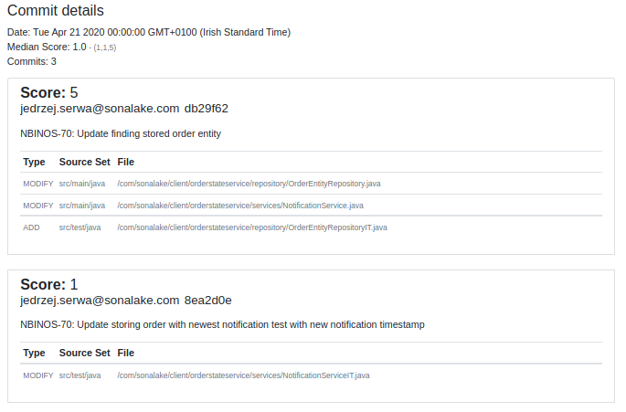

# Shotgun
_(shoot 'em 'fore they run now)_


## What does this do?

Shotgun spots when feature or bugfixes require large or complex changes to 
the codebase. These are normally ok at the beginning or even the middle of 
a project but if they carry on to the end of a project then it indicates that
the codebase is going to be difficult to maintain.

i.e. _if a lot of fixes require changes all over the place, then your code is
hard to maintain_

This works by performing an analysis of the git history to determine the _"shotgun"_ complexity 
(more on this below) of an application. This differs from 
[McCabe's cyclomatic complexity](https://en.wikipedia.org/wiki/Cyclomatic_complexity)
insofar as it doesn't examine the graph of the underlying code so much as it
examines the graph of how files get changed over time by examining the git
history and deriving a score based on the _inter-relatedness_ of the files.


Perhaps the easiest way to use this is with the [shotgun-gradle-plugin](https://bitbucket.org/sonalake/shotgun-gradle-plugin/)

# Output format

What does this produce?

## Heatmap and hot spots
**NOTE:** When deriving the heatmap for a given day, it is the _median_ score for that
day that is used.


Where:

* `Active Commit Sets` are those sets of files that are committed at the same time most often.
* `Active Files` are those files that are committed most often. 

The intention is to spot hotspots in the code that require a lot of attention

## Daily commits

Each individual day can also be examined to see what commits went into the 
calculation of that day's score.



 
# How to build and use this?

## Command line tool
To build the commandline tool:
    
    ./gradlew build shadowJar


And to use it, just pass in `-h` to the fatjar to see the options

    java -jar build/libs/shotgun-all.jar -h


The only mandatory option is `-i, --input-dir`

```
Usage: <main class> [options]
  Options:
    -m, --commit-minimum
      Files and sets with a commit size less than this are ignored
      Default: 3
    -cf, --commit-size-file
      We want the files in the top N counts (this may result in more than N 
      results) 
      Default: 40
    -cs, --commit-size-set
      We want the sets in the top N counts (this may result in more than N 
      results) 
      Default: 10
    -h, --help
      Print this help message
  * -i, --input-dir
      The working directory, must be a git root directory
    -o, --output-file
      The output file location
      Default: .shotgun/report.html
    -s, --source-set
      A source set to split by
      Default: []
    -l, --legendLevel
      add legend level
      Default: [10, 20, 30, 50, 80, 120]

```    

A sample usage where we want to specify source sets, but otherwise accept the defaults 
might be:

    java -jar build/libs/shotgun-all.jar \    
    -i ~/workspaces/enet/billing-validation 

## Gradle plugin

There is also a gradle plugin for this: [shotgun-gradle-plugin](https://bitbucket.org/sonalake/shotgun-gradle-plugin/)

# How is shotgun coherency calculated?

The **shotgun coherency** score is a function of how close to each other the files
in a given commit are, where:

* Files in the same directory are considered closer than files in different 
directories
* Files in directories directly above/below each other are considered closer than
files in adjacent directories 

The expected behaviour of a project is that, while there may be lots of changes
all over the codebase at the start of the project, one would expect that as
the architecture settles down that any changes that are added are in small
commits, each centered on a small number of packages.

As a project gets to be more mature, however, if a bugfix or new feature still 
requires a commit in many different packages, then that points to a need to 
refactor the codebase to simplify things. 


## Deriving the score

A commit's shotgun score is derived as follows:

1. Identify the source tree of each file, e.g.
    * `src/main/java`
    * `src/main/resources`
    * `src/main/webapp`
    * `src/test/java`
    * `src/test/resources`
1. Then, for each of these source trees, determine the lowest common tree for
the commits, e.g.
    * For Files (ignoring any `DELETE` entries - removing code doesn't _add_ to the complexity ;) )
        * `com/sonalake/application/service/BobService.java`
        * `com/sonalake/application/domain/BobRepository.java`
        * `com/sonalake/application/domain/Bob.java`
        * `com/sonalake/application/domain/BobType.java`
    * Because `com/sonalake//application` is common to all of these files, this gets
    simplified to:
        * `application/service/BobService.java`
        * `application/domain/BobRepository.java`
        * `application/domain/Bob.java`
        * `application/domain/BobType.java`
1. The score for this source tree is then calculated as a simple count of the 
    `edges` of this graph, or if there is only a single file present, the 
    score will be `1`.
1. The overall score for the commit is the _sum_ of the scores for the source trees.

Should a given day have multiple commits, then it is the _median_ of that day's scores
that will be used.

Should a weekend have _any_ commits then management owes the team an apology ;)


# Thanks to third party libraries

This report embeds a few other libraries into its page, rather than using CDNs, 
because it makes it easier to ask Jenkins to render this

The libs embedded in the html page are:

- [Bootstrap](https://getbootstrap.com/) for the general presentation
- [jQuery](https://jquery.com/) for general monkey-business
- [CalHeatMap](https://cal-heatmap.com/) for the heat map, a [d3](https://d3js.org/) component.

